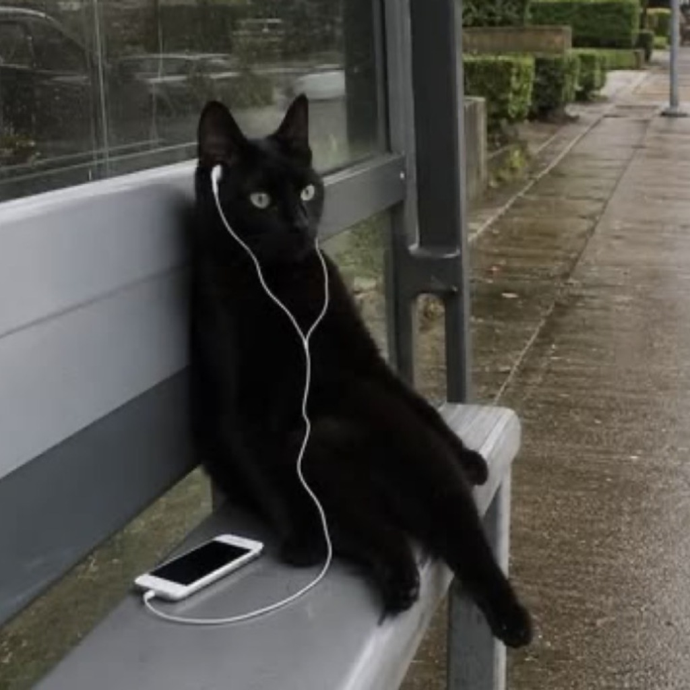

<p align="center">
  
</p>

<h1 align="center">Offline Music</h1>

<p align="center">
  A private-first local music player for iPhone.<br>
  Fast launch, honest offline playback, portable backups, and optional ChatGPT control.
</p>

<p align="center">
  
  
  
  
</p>

Offline Music is a focused player for audio files you already own. It keeps playable media on-device, reads embedded metadata, supports playlists and lyrics, and avoids turning a simple offline library into another streaming account.

## Highlights

- Import local audio through the iOS document picker.
- Read title, artist, album, duration, and embedded artwork.
- Build playlists, reorder or shuffle them, and manage the playback queue.
- Use artwork-derived colors throughout the selected album screen.
- Edit lyrics and artwork directly in the app.
- Export the complete library to a normal, readable folder.
- Restore that folder later without relying on a proprietary archive format.
- Optionally connect ChatGPT through an OAuth-protected MCP server.

## Data safety

The library is local-first. Metadata writes are atomic and protected by a rotating set of validated backups. If the newest metadata file is damaged or becomes incompatible, the app restores the latest valid local copy and quarantines the damaged file instead of overwriting it with an empty library.

Cloud sync has an additional destructive-change guard. Unexpected omissions and mass deletions are blocked, a recovery snapshot is created, and removed audio is quarantined rather than erased immediately.

### Portable export layout

```text
Offline Music Export 2026-08-19 12-30-00/
├── manifest.json
├── Playlist Covers/
│   └── <playlist-id>.jpg
└── Tracks/
    └── <track-id>/
        ├── audio.m4a
        ├── cover.jpg
        ├── lyrics.txt
        └── metadata.json
```

The versioned manifest also preserves playlists, the selected playlist, queue state, dates, remote references, and track relationships. Import rejects unsupported manifests, missing audio, and paths that try to escape the chosen folder.

## Fast startup

The first frame does not wait for library JSON decoding or cloud traffic. Local metadata is loaded and validated off the main thread, while sync begins only after the local library is ready. Audio metadata and artwork processing also stay away from the launch path.

## ChatGPT / MCP

The optional backend exposes narrowly scoped music-library tools through OAuth with PKCE. Open Settings in the app, copy the MCP URL, add it as a custom connection in ChatGPT, and generate the one-time six-digit linking code when prompted.

The current public MCP endpoint is:

```text
https://lev11111-zelo-ai-backend.hf.space/mcp
```

ChatGPT can create albums, add or edit tracks, set covers and lyrics, and delete individual tracks. Album deletion is intentionally not exposed.

## Project structure

| Path | Purpose |
| --- | --- |
| `OfflineMusic/Sources` | SwiftUI app, player, persistence, import/export, and cloud client |
| `OfflineMusic/Resources` | App icon, default artwork, and Info.plist |
| `backend` | FastAPI sync, OAuth, and MCP service |
| `project.yml` | Reproducible XcodeGen project definition |

## Build locally

Requirements: Xcode 16 or newer, XcodeGen 2.42 or newer, and an iOS 17+ simulator.

```sh
xcodegen generate
xcodebuild \
  -project OfflineMusic.xcodeproj \
  -scheme OfflineMusic \
  -sdk iphonesimulator \
  CODE_SIGNING_ALLOWED=NO \
  build
```

Backend checks:

```sh
python3 -m venv .venv
.venv/bin/pip install -r backend/requirements.txt
PYTHONPATH=backend .venv/bin/pytest backend/tests -q
```

## Security and privacy

- Imported audio and artwork remain in the app container unless you explicitly export or sync metadata.
- Device and OAuth credentials are stored in the iOS Keychain, not source files or `UserDefaults`.
- Runtime database and signing secrets are injected by the deployment environment and are not part of this repository.
- Please report vulnerabilities through GitHub's private security advisory flow; see [SECURITY.md](SECURITY.md).

## Status

This is a personal utility built around a deliberately small product surface. The repository is public for transparency and learning; no license is granted for redistribution or commercial use.
